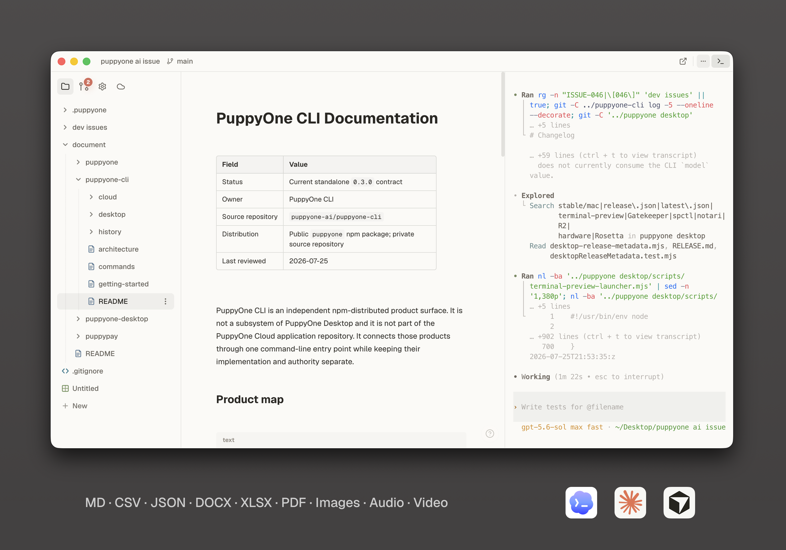

<div align="center">
  

  <h1>puppyone</h1>

  <p><b>A local-first editor. Built for you and your agents.</b></p>

  <p>
    <a href="https://www.puppyone.ai"></a>
    <a href="https://www.puppyone.ai/doc"></a>
    <a href="https://discord.gg/zwJ9Y3Uvpd"></a>
    <a href="https://x.com/puppyone_ai"></a>
  </p>
</div>


## Install

```bash
npm install --global puppyone
```

## Start

```bash
puppyone
```

## Features

- **Rich files** — Edit and preview Markdown, HTML, CSS, CSV, JSON, DOCX, XLSX, PDF, media, 3D files, and more.
- **Local-first** — Work with local folders; files stay local unless you choose Cloud.
- **Git** — Review changes and keep project history with local Git.
- **Terminal & agents** — Built-in terminal with Codex, Claude Code, Cursor, and OpenCode.
- **Puppyone Cloud (optional)** — Hosting, backup, and always-on MCP or CLI access.
- **Cloud collaboration (optional)** — Invite teammates to hosted projects.

## License

Code is licensed under the [Apache License 2.0](LICENSE).

## Privacy

Desktop product analytics are currently disabled. The bounded event catalog,
data exclusions, retention, and contact channel are published in
[Product analytics](docs/telemetry.md).

The puppyone name, logo, icons, and other brand assets are not granted under
the Apache License. See [TRADEMARK.md](TRADEMARK.md).
