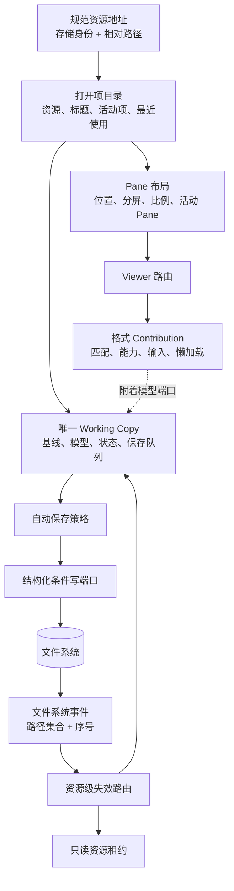

# Editor Architecture

本目录是随产品代码维护的编辑器架构摘要，正文统一使用中文。

## 核心决定

每个存储身份与规范资源路径只对应一个 Working Copy。编辑器工作台分成三类状态：打开项目录记录“打开了什么”，Pane 布局记录“显示在哪里”，Working Copy 记录“内容是什么、是否需要保存”。三者通过稳定身份关联，不互相代管状态。

## 不变量

1. 没有本地模型编辑时，任意 watcher、refresh、split、attach/detach 序列的写入次数为零。
2. 干净外部更新直接采纳；脏或保存中的外部更新进入显式冲突。
3. 条件写冲突是结构化结果，不依赖 Electron Error 自定义字段。
4. Viewer 不直接读取或写入文件。
5. 自动保存策略不拥有版本和冲突语义。
6. 当前同一路径至多一个可见可编辑模型；未来开放并发多视图前必须先升级为一对多模型协议。
7. 每个可编辑 Viewer 都必须出现在 Registry 驱动的 P0 外部一致性测试矩阵中。
8. 打开、关闭、重命名和 Pane 移动只改变工作台元数据，不能触发文档写入。
9. 布局树只引用 `editorId`，不能持有文件内容、存储端口或保存状态。
10. 格式 Contribution 只声明该格式的匹配、能力、输入与懒加载入口；中央 Registry 只负责确定性组合和路由。

## 文档

- [Document Editing and Persistence](./document-editing-persistence.md)
- [Editor Workbench Boundaries](./editor-workbench-boundaries.md)
- [File Format and Viewer Pipeline](./file-format-viewer-pipeline.md)
- [Preview Transitions](./smooth-preview-transitions.md)
- [Markdown Editor](./markdown/README.md)
- [Office](./office/README.md)
- [Viewer Plugin Architecture](./viewer-plugin-architecture.md)
