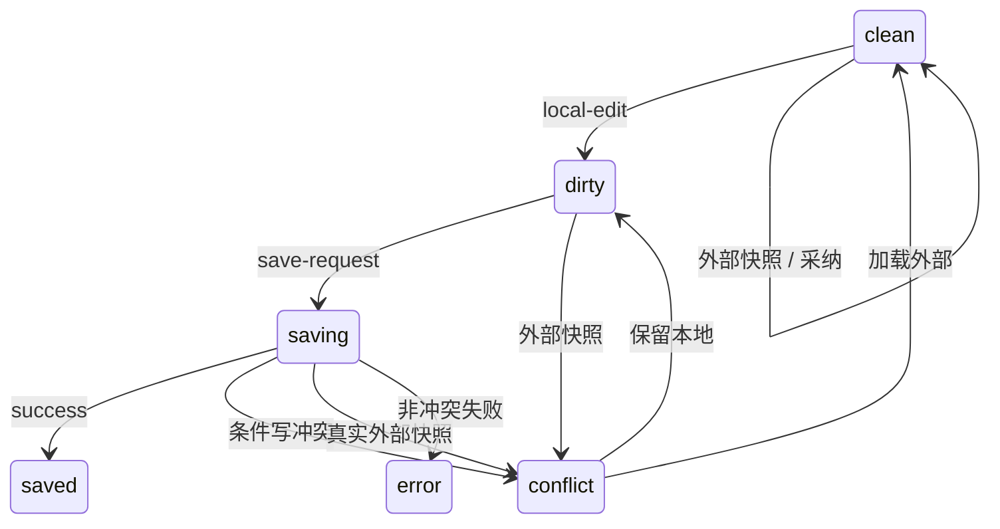

# Document Editing and Persistence

## Working Copy

身份为稳定存储身份与规范资源路径的组合。即使 React 重建了存储适配器对象，只要稳定存储身份相同，仍复用同一个实例；不同工作区的同名路径严格隔离。实例持有持久化内容、存储版本、当前格式模型与修订、可选外部候选、状态和单一保存队列。其生命周期独立于 React 与 Pane。

## 事件

- `local-edit`：唯一能产生 dirty 的事件；
- `storage-snapshot`：初次读取或资源级外部变化；
- `save-request` / `save-result`：保存协议；
- `resolve-conflict`：用户选择；
- `attach/detach`：不改变状态。

## 条件写结果

存储端口返回 `success | conflict | not-found | permission-denied | io` 的判别联合。冲突携带最新内容与版本；只有成功才能推进基线。未知协议故障才抛异常。

## P0 不变量

页面保持打开、Agent 修改文件、watcher 通知、Viewer 重新挂载的完整链路若没有本地编辑，必须自动显示 Agent 内容且 persist 调用数为零。

## P0 测试门禁

- `tests/editorExternalConsistencyMatrix.integration.test.tsx` 对 Markdown、文本、代码、JSON、CSV、TSV、HTML 和 PuppyFlow 执行 clean update、完整 remount、dirty conflict、显式保留本地四组矩阵。
- 矩阵从 `PRESET_VIEWERS` 动态核对全部 `capability=edit` 的 Viewer；新增可编辑 Viewer 未增加夹具时测试失败。
- 同一 watcher 批次必须正确更新不同格式 Pane，无关路径不得重读。
- 过时异步读取不得覆盖较新版本；读取失败必须保留最后稳定模型。
- watcher 测试覆盖路径去重、未知路径全量失效、自身写入过滤和同批 Agent 路径保留。
- IPC、Renderer Adapter 与 Document Session 分别验证 `conflict | not-found | permission-denied | io` 结构化结果。
- HTML 等只显示 Preview 的编辑格式仍需附着轻量快照端口，不能依赖 CodeMirror 恰好挂载。

当前 Workbench 对同一路径的可见 Pane 去重。如果未来支持同一文档的并发多视图，必须先提供一对多模型广播和双向编辑测试，不能让最后附着的端口隐式成为权威。

实现位于 `packages/shared-ui/src/editor/document-session/`、`src/features/editor-workbench/`、`src/lib/localFiles.ts` 与 `electron/main/ipc/workspace-files-ipc.mjs`。
