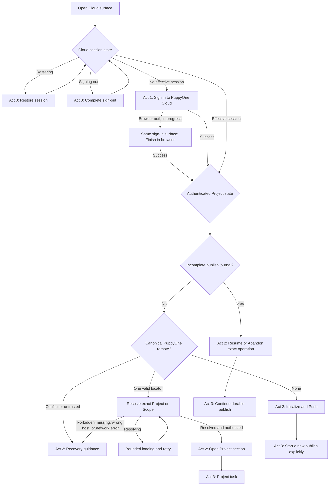

# Cloud Entry Authentication and Project Context UX

This document is the source of truth for what PuppyOne Desktop renders from the
moment a user opens the Cloud surface until a Project-specific action becomes
available. It keeps authentication, repository identity, and publish state
separate so the UI never implies that an existing Cloud Project disappeared
merely because the user signed out.

Related documents own adjacent concerns:

- [Cloud Repository Context Boundaries](cloud-workspace-state.md) owns the
  authority and persistence model.
- [Local and Cloud UX](local-and-cloud-ux.md) owns the Local Only, Local + Cloud,
  and Cloud Only capability model.
- [Cloud Project Publish Coordinator](cloud-publish-coordinator.md) owns the
  durable `Initialize and Push` operation after the user explicitly starts it.

## Product invariant

Authentication is the outer gate. Project state is interpreted for presentation
only after Desktop has an effective Cloud session for the selected Cloud
environment.

Consequently:

- signed out never means not initialized;
- no canonical PuppyOne remote never means signed out;
- a canonical remote locates a Project or Scope but never authorizes it;
- stale workspace config never proves that a Cloud Project exists; and
- an incomplete publish journal is resumed, not presented as a new publish.

These are independent facts even when they are discovered concurrently. Their
screen priority is session transition, authentication, durable publish recovery,
then repository context.

## Screen sequence

### Act 0 — restore or sign-out transition

While Electron is restoring a session, or completing sign-out, Desktop shows a
neutral bounded loading state. It does not briefly flash either the sign-in page
or the initialization page.

This act is transitional and has no product action.

### Act 1 — establish identity

When no effective session exists, the first actionable screen is the single
PuppyOne Cloud sign-in entry:

- one PuppyOne Cloud mark;
- one `Sign in to PuppyOne Cloud` primary action;
- account-level Cloud benefits and terms only; and
- `Finish in browser…` on the same surface while browser authentication is in
  progress.

This screen must not show the local repository, a push arrow, `New Cloud
project`, `Not initialized`, `Initialize and Push`, or any other publish intent.
Signing in establishes identity only; it never silently creates or uploads a
Project.

### Act 2 — establish Project truth

After authentication, Desktop evaluates durable publish recovery and actual Git
state:

- an incomplete publish journal shows `Resume` or `Abandon` for that exact
  operation;
- no canonical PuppyOne remote shows the signed-in `Initialize and Push` flow;
- one valid canonical remote resolves its exact Project-root or Scope target;
- an authorized resolved target opens the requested Project section; and
- conflict, wrong-host, forbidden, missing, or temporarily unavailable targets
  show recovery guidance rather than initialization.

The second act is therefore not always an initialization screen. It is the
screen justified by authenticated Project truth.

### Act 3 — perform the selected task

Only after Acts 1 and 2 may Desktop create a Project, push Git history, show
Project contents, open Claude, manage Automation, or expose Access and Settings.
Task-specific routes may add their own loading and error states without
bypassing the entry sequence.

## Decision flow

## Presentation decision table

The first matching row wins.

| Priority | Effective session | Publish journal | Canonical remote / context | Presentation | Primary action | Must not appear |
|---:|---|---|---|---|---|---|
| 1 | restoring | any | any | Neutral session loading | none | Sign-in, initialization, or Project errors |
| 2 | signing out | any | any | Neutral sign-out transition | none | Initialization or Project errors |
| 3 | no | any | any | PuppyOne Cloud sign-in entry | `Sign in to PuppyOne Cloud` | Repository summary, push arrow, `New Cloud project`, `Not initialized` |
| 4 | no, browser auth pending | any | any | Same sign-in entry with progress | `Finish in browser…` | Initialization or automatic publish |
| 5 | yes | incomplete | any | Durable publish recovery | `Resume` or `Abandon` | A fresh Project-creation intent |
| 6 | yes | none | none | Local Only initialization | `Initialize and Push` | Signed-out copy or a missing-Project error |
| 7 | yes | none | one, resolving | Bounded Project resolution | retry only after failure | Initialization |
| 8 | yes | none | one, resolved | Requested Project section | route-specific action | Initialization |
| 9 | yes | none | conflict or recovery | Specific recovery state | retry, repair, or switch account | Initialization or guessed Project content |

## Copy and interaction guardrails

### Authentication surface

- Talk about the Cloud account, not the open folder.
- Use one Cloud mark and one primary sign-in action.
- Keep browser-auth progress on the same surface.
- Do not offer upload, initialization, Organization selection, or Project
  recovery before authentication succeeds.

### Initialization surface

- Render only for an authenticated Local Only repository.
- Describe one explicit destination: a new Cloud Project.
- Keep `Initialize and Push` user-initiated; signing in alone is not consent.
- Preserve staged, unstaged, and untracked changes locally.

### Existing or recoverable Project

- A valid canonical remote must resolve before Project UI appears.
- Signing out replaces Project UI with the account sign-in surface; it does not
  replace it with initialization.
- After signing back in, resolve the remote again and restore the Project or a
  specific recovery state.
- Never use a historical config Project ID to skip authorization or to guess
  that the open folder is connected.

## Implementation ownership

| Responsibility | Owner |
|---|---|
| Global session restore and auth events | [`useDesktopCloudSession.ts`](../../src/features/cloud/hooks/useDesktopCloudSession.ts) |
| Environment-specific effective session | [`auth/`](../../src/features/cloud/auth/) |
| Entry-screen priority and main presentation | [`CloudServiceMainView.tsx`](../../src/features/cloud/CloudServiceMainView.tsx) |
| Shared signed-out entry | [`ProjectBrowser.tsx`](../../src/features/cloud/components/ProjectBrowser.tsx) |
| Signed-out versus initialize sidebar guidance | [`CloudServiceSidebar.tsx`](../../src/features/cloud/CloudServiceSidebar.tsx) |
| Canonical-remote Project context | [`context/`](../../src/features/cloud/context/) |
| Durable publish state and explicit start/resume | [`usePuppyoneCloudBackup.ts`](../../src/features/cloud/workspace/usePuppyoneCloudBackup.ts) |
| Presentation regression assertions | [`cloudHubIntegration.test.tsx`](../../tests/cloudHubIntegration.test.tsx) |

Presentation components consume these states. They must not independently
reconstruct authentication or Project identity from route names, cached labels,
workspace JSON, or button intent.

## Maintenance rules

1. Add a row to the decision table before adding a new entry state.
2. Preserve first-match priority in `CloudServiceMainView`; authentication must
   remain above local-only and publish presentation.
3. Reuse the shared sign-in entry across Cloud, Access, and Automation rather
   than creating route-specific logged-out pages.
4. A new recovery condition belongs below authentication and above
   initialization whenever a canonical locator exists.
5. User-visible copy describes the action the user is choosing, not internal
   Project creation, credential issuance, IPC, or Git transport steps.
6. Every change updates the acceptance matrix and an automated presentation
   assertion.
7. If entry decisions outgrow one presentation owner, extract one pure resolver
   and test its precedence; do not distribute competing decisions across route
   components.

## Acceptance matrix

1. Signed out + no canonical remote: show only the Cloud sign-in entry.
2. Signed out + canonical remote: show the same Cloud sign-in entry; do not
   imply the remote or Cloud Project disappeared.
3. Browser sign-in pending: keep the sign-in surface and show `Finish in
   browser…`.
4. Sign in + no canonical remote: show authenticated `Initialize and Push`.
5. Sign in + valid authorized remote: resolve and open Project content.
6. Sign in + valid unauthorized remote: show permission recovery, never
   initialization.
7. Sign out from a resolved Project: return to the Cloud sign-in entry without
   showing `New Cloud project` or `Not initialized`.
8. Sign back in with access: resolve the canonical remote again and restore the
   Project section.
9. Incomplete publish + signed out: show sign-in first; after authentication,
   show `Resume` or `Abandon`, never a fresh publish.
10. Historical Cloud-shaped workspace config + no canonical remote: after
    authentication, remain Local Only; never infer Project identity from the
    config.
