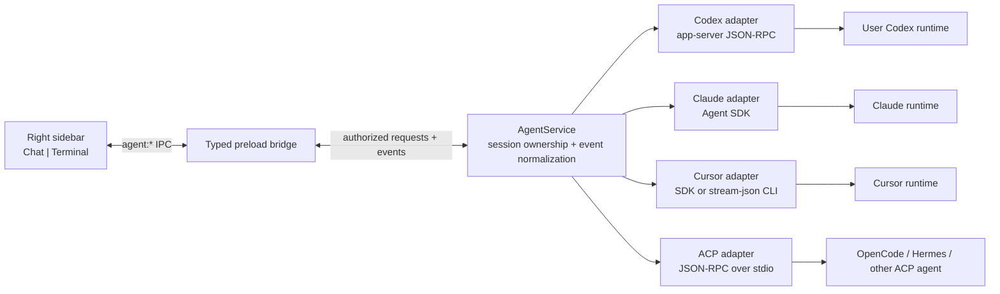
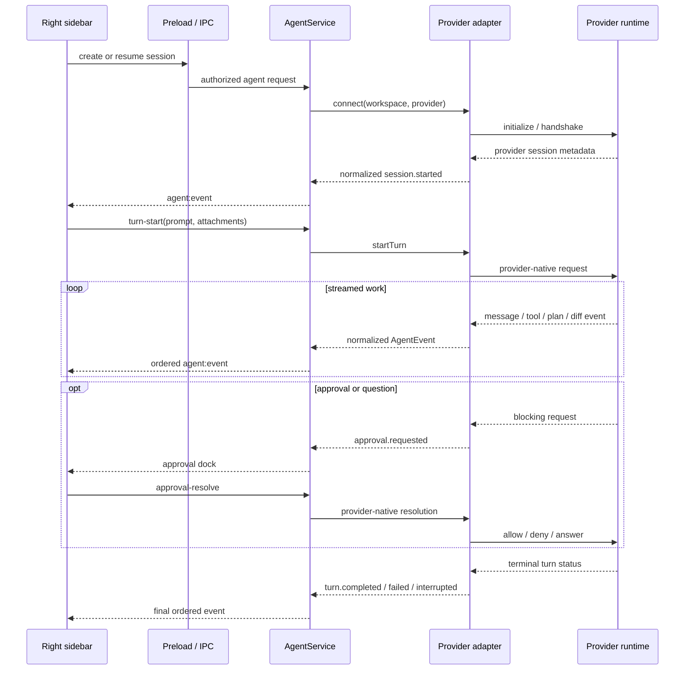

# Desktop Agent Architecture

This directory is the architecture home for a structured coding-agent
experience in PuppyOne Desktop. It defines how the right sidebar can present a
real chat surface while delegating reasoning and tool execution to a user's
Codex, Claude Code, Cursor, OpenCode, Hermes, or another compatible local
agent runtime.

The terminal remains a first-class sibling surface. The agent experience does
not parse terminal escape sequences or scrape a terminal UI into chat bubbles.

## Status legend

- **Implemented** describes behavior present in the current codebase.
- **Proposed** describes the accepted target contract that still requires code
  and test changes.
- **Product gate** describes a provider-specific legal, authentication, billing,
  or protocol decision that must be resolved before that adapter ships.

Unless a section is explicitly marked **Implemented**, this package describes
the **Proposed** architecture.

## Implementation status (July 2026)

**Implemented:** the first Codex vertical slice now provides a structured
Chat surface beside Terminal, Codex executable discovery, app-server
initialization over stdio JSONL/JSON-RPC, existing-account and model reads,
thread create/resume, streamed normalized events, command/file approvals,
interrupt, bounded live replay, a retained local session journal, owner-bound
IPC, redacted diagnostics, and symmetric window/app cleanup.

**Known gaps:** PuppyOne does not host Codex login yet; users authenticate with
Codex externally and use Refresh. Experimental structured questions,
permission approvals, MCP elicitations, dynamic tools, and attestation fail
closed and remain Proposed. The local journal is deliberately bounded, so an
old or very large restored transcript can be marked partial. Claude, Cursor,
ACP, Cloud execution, fork, and steer remain Proposed or Product gated as
described below.

## Documents

1. [Right Sidebar Agent Chat](right-sidebar.md)
   - Product hierarchy, Chat/Terminal switching, transcript, approval and
     question docks, composer, resize, focus, accessibility, and state
     ownership.
2. [Codex Implementation Brief](implementation-brief.md)
   - Copy-paste handoff for another agent to implement the first Codex-backed
     vertical slice without expanding into the gated providers.

## Decision summary

**Implemented for Codex; Proposed for additional providers:** A structured
Agent Chat surface is present in the existing resizable right sidebar and the
current Terminal remains a neighboring tab.

The renderer consumes one normalized event model. Provider-specific protocols
stay behind adapters in the Electron main process:



The architecture deliberately separates three concerns:

1. PuppyOne owns presentation, workspace authorization, process lifecycle,
   and the normalized event journal.
2. Each adapter owns one provider protocol and maps it to PuppyOne's common
   session, turn, item, approval, and question contracts.
3. The user's selected runtime owns model behavior, provider authentication,
   provider-native conversation state, tools, rules, skills, and inference
   billing.

## Current baseline

The following behavior is **Implemented**:

- `RightTerminalPanel.tsx` mounts xterm in the right sidebar and communicates
  through the context-isolated preload bridge.
- `electron/main/terminal-service.mjs` owns `node-pty` sessions, confines the
  requested working directory to the authorized workspace, and scopes every
  terminal to its owning `WebContents`.
- The sidebar is resizable from 420px to 760px and is available only for local
  workspaces.
- Window teardown and app shutdown close owned terminal sessions.
- Workspace watchers, Git status, edit review, and file preview already react
  to filesystem changes independently from the terminal.
- `RightCompanionPanel` keeps Chat and Terminal mounted as sibling surfaces,
  retains their shared width and selected-surface preference, and preserves
  Terminal's lazy PTY lifecycle.
- `AgentService` and `CodexAppServerAdapter` own Codex discovery, app-server
  protocol state, session ownership, normalized replay, approvals,
  persistence, and cleanup in Electron main.
- The renderer projects only normalized `AgentEvent` envelopes and never sees
  Codex credentials, environment variables, or raw protocol unions.

Those boundaries remain valid. Agent Chat is additive and does not move model
processes, credentials, or tool execution into the renderer.

## Product contract

The Desktop Agent feature owns:

- provider discovery and readiness state;
- provider, model, and operating-mode selection;
- agent session creation, restoration, and explicit reset;
- user messages and streamed assistant output;
- normalized tool, command, file-change, plan, usage, and error events;
- approval and structured-question interactions;
- interrupt, steer, and follow-up behavior when supported;
- a provider capability model that lets the UI hide unsupported actions;
- local event-journal metadata needed to restore the PuppyOne presentation.

It does not own:

- raw terminal emulation, PTY sizing, or shell history;
- provider inference implementation or model quality;
- provider credentials copied out of the provider's supported auth flow;
- Git source-of-truth calculations or diff rendering outside compact chat
  summaries;
- Cloud workspace execution in the first implementation phase;
- an attempt to make every provider expose identical advanced behavior.

## Layer boundaries

### Renderer: Agent Chat presentation

**Implemented for the Codex vertical slice:** `src/features/desktop-agent/`

The renderer owns view state and presentation only:

- selected Chat or Terminal surface;
- session list and active session metadata;
- transcript projection from normalized events;
- composer state and attachments;
- compact plan, tool, command, and diff cards;
- approval and question docks;
- stop, retry, resume, and reset controls;
- provider capability-aware labels and disabled states.

The renderer must not spawn provider processes, read credential files, infer
approval safety, or send arbitrary executable strings to a shell.

See [Right Sidebar Agent Chat](right-sidebar.md) for the UI and state contract.

### Preload: narrow typed bridge

**Implemented for the Codex vertical slice:** `electron/preload.cjs` plus types in
`src/types/electron.d.ts`.

The bridge exposes explicit operations rather than a generic process API:

```text
agent:providers-discover
agent:models-list
agent:account-read
agent:session-create
agent:session-resume
agent:session-close
agent:turn-start
agent:turn-steer
agent:turn-interrupt
agent:approval-resolve
agent:question-resolve
agent:event
agent:session-exit
```

Every mutation carries an application session ID. Requests that touch a
workspace also carry its root path so the main process can apply the existing
window-to-workspace authorization before forwarding them to `AgentService`.

The bridge does not expose raw `spawn`, environment variables, stdin, filesystem
paths outside the authorized workspace, or provider tokens.

### Main process: AgentService

**Implemented locations:**

```text
electron/main/agent/
  agent-service.mjs
  agent-events.mjs
  agent-persistence.mjs
  provider-discovery.mjs
  jsonl-rpc-connection.mjs
  adapters/
    codex-app-server-adapter.mjs
electron/main/ipc/agent-ipc.mjs
```

Claude, Cursor, and ACP adapters in the earlier proposed component map remain
unbuilt and are not represented by placeholder runtime files.

`AgentService` is the only owner of live agent sessions. Each session record
contains at least:

```text
application session id
owning WebContents id
canonical workspace root
provider id and adapter instance
provider-native session/thread id
active turn id and state
monotonic event sequence
capability snapshot
process or SDK cleanup handle
```

Its responsibilities are:

- authorize and canonicalize the workspace before adapter creation;
- discover an executable through the user's login-shell environment, then
  spawn the resolved absolute path without `shell: true`;
- initialize adapters and perform protocol handshakes;
- normalize provider events and enforce ordering;
- correlate pending approvals/questions with the active session and turn;
- reject responses to stale or foreign requests;
- interrupt and dispose processes symmetrically;
- limit line size, buffered output, journal size, and retry behavior;
- remove credentials and sensitive values from diagnostic logs;
- close window-owned sessions on renderer destruction and all sessions on app
  quit.

Terminal sessions and agent sessions use separate services. A provider can run
terminal tools internally without becoming a PuppyOne PTY session.

### Provider adapters

Every adapter implements the smallest common interface and advertises optional
capabilities instead of relying on provider-name checks in the UI:

```ts
type AgentAdapter = {
  discover(): Promise<ProviderReadiness>;
  connect(options: AdapterConnectOptions): Promise<AdapterConnection>;
  listModels?(): Promise<AgentModel[]>;
  readAccount?(): Promise<AgentAccountState>;
  createSession(input: CreateSessionInput): Promise<ProviderSession>;
  resumeSession(input: ResumeSessionInput): Promise<ProviderSession>;
  startTurn(input: StartTurnInput): Promise<ProviderTurn>;
  steerTurn?(input: SteerTurnInput): Promise<void>;
  interruptTurn(input: InterruptTurnInput): Promise<void>;
  resolveApproval?(input: ApprovalResolution): Promise<void>;
  resolveQuestion?(input: QuestionResolution): Promise<void>;
  closeSession(input: CloseSessionInput): Promise<void>;
  dispose(): Promise<void>;
};
```

Representative capabilities include:

```text
streamingText
structuredToolEvents
commandOutputStreaming
fileChangeEvents
manualApprovals
structuredQuestions
resume
fork
steer
attachments
modelSelection
usage
accountState
```

Unknown provider fields are ignored and retained only in an optional redacted
diagnostic payload. A new provider event must not crash the event reader.

## Normalized domain model

**Implemented for the Codex event vocabulary in the implementation brief.**
Question events from the broader proposed vocabulary remain capability-gated.

PuppyOne uses provider-neutral session, turn, and item concepts:

- **Session** is a durable conversation bound to one provider and workspace.
- **Turn** begins with one user submission and ends in a terminal status.
- **Item** is a displayable or actionable unit inside a turn.
- **Request** is a blocking approval or structured question owned by a turn.

All adapter output is wrapped in a versioned envelope:

```ts
type AgentEvent = {
  schemaVersion: 1;
  sequence: number;
  sessionId: string;
  provider: "codex" | "claude" | "cursor" | "acp";
  providerSessionId: string | null;
  turnId: string | null;
  itemId: string | null;
  emittedAt: string;
  type: AgentEventType;
  payload: unknown;
};
```

The first event vocabulary should cover:

```text
session.started              session.resumed
session.metadata.updated     session.closed
turn.started                 turn.completed
turn.failed                  turn.interrupted
assistant.delta              assistant.completed
reasoning.summary.delta      plan.updated
tool.started                 tool.progress
tool.completed               command.output.delta
file.change.updated          usage.updated
approval.requested           approval.resolved
question.requested           question.resolved
provider.warning             provider.error
```

Provider-native data is mapped into stable payloads. The UI must not inspect a
Codex JSON-RPC method, a Claude SDK message class, a Cursor stream-json subtype,
or an ACP update directly.

## Session lifecycle

**Implemented for create, resume, turn start, approval, interrupt, replay, and
close.** Steer and structured questions remain Proposed.



Hiding the sidebar never terminates an active turn. The main process continues
to own it, and the renderer can resubscribe from the latest known sequence when
the Chat surface remounts. Explicit Stop interrupts the turn; explicit Reset
closes the session and starts a new one.

## Persistence and source of truth

**Implemented with bounded retention:** at most 20 local application sessions,
400 events and 512 KiB per retained session. Credentials are redacted and are
not persisted. Truncated journals restore with an explicit partial-history
state.

Provider-native histories remain the source of truth for provider resume.
PuppyOne stores only what it needs to restore its own presentation and mapping:

- application session ID;
- canonical workspace identity;
- provider and provider-native session ID;
- user-facing title, timestamps, and last terminal state;
- selected model/mode when the provider exposes them;
- a bounded normalized event journal or compact projection checkpoint;
- last committed event sequence.

This data belongs under Electron `userData`, not inside the user's repository.
Conversation transcripts and tool output may contain secrets, so persistence
must have an explicit retention limit and a future user-facing delete action.
No credential value is stored in the event journal.

When provider history and the local projection disagree, provider history wins
for model context while PuppyOne rebuilds or marks its local presentation as
partial. The UI must not silently invent missing tool results.

## Provider strategy and product gates

| Provider | Proposed integration | Capability expectation | Auth and product gate |
| --- | --- | --- | --- |
| Codex | `codex app-server` over stdio JSONL/JSON-RPC | Full chat, tools, diffs, approvals, questions, resume, fork, steer, interrupt, model and account state | **Proposed first provider.** Use Codex-managed ChatGPT OAuth or API-key auth. Identify PuppyOne through `clientInfo`; enterprise distribution may require OpenAI client registration. |
| Claude Code | TypeScript Claude Agent SDK | Full structured messages, `canUseTool`, questions, session resume/fork, file checkpointing | **Product gate.** Default to customer API keys or supported enterprise/cloud providers. Do not expose Claude.ai subscription login or rate limits without Anthropic approval. |
| Cursor | Official Cursor SDK; stream-json CLI only as a compatibility experiment | Structured text/tool events, resume, modes, interruption; manual host approval parity requires verification | **Product gate.** The official SDK uses `CURSOR_API_KEY` and token billing. Do not market reuse of a user's Cursor subscription login until Cursor's embedding terms and manual-approval behavior are confirmed. |
| ACP | ACP client over stdio JSON-RPC | Sessions, streaming messages, tools, diffs, terminal activity, approvals, questions, cancellation; exact optional features are capability-driven | **Proposed extensibility adapter.** Enables OpenCode, Hermes, and other ACP agents while they retain their own provider setup and credentials. |

OpenCode and Hermes are optional agents, not an invisible compatibility layer
in front of Codex, Claude Code, or Cursor. Replacing a user's selected runtime
with another agent loop would change tool behavior, rules, skills, memory,
approval semantics, and billing.

## Approval and question invariants

- The default posture is fail closed: an unrenderable, expired, timed-out, or
  disconnected approval is denied.
- PuppyOne never starts a provider with `--force`, `--yolo`, bypass-permissions,
  or an equivalent unrestricted mode merely to avoid implementing approvals.
- An approval resolution includes session ID, turn ID, request ID, and the
  expected provider so stale UI cannot approve a newer action accidentally.
- “Always allow” is shown only when the provider returns a durable permission
  update that PuppyOne can explain before it is persisted.
- Provider suggestions can be displayed, but the main process and provider
  remain responsible for enforcing the final rule.
- Structured questions are not approvals. They use a distinct event and
  response path and may allow free-form answers when the provider supports it.
- Closing a window denies or cancels its unresolved requests before cleanup.

## Executable discovery and environment

Electron apps launched from Finder or another desktop shell may not inherit the
same `PATH` as an interactive terminal. Provider discovery therefore cannot use
the renderer environment or assume `codex`, `claude`, or `cursor-agent` is
directly available.

The main process should:

1. read the user's login-shell environment once with a bounded timeout;
2. resolve approved provider executable names to absolute paths;
3. record only path, version, and readiness diagnostics;
4. spawn the absolute executable with an argument array and a deliberately
   constructed environment;
5. preserve provider-supported credential resolution without copying credential
   files or returning secrets to the renderer;
6. re-run discovery after an explicit Refresh action or relevant settings
   change, not on every render.

The UI distinguishes `not-installed`, `installed-not-authenticated`,
`unsupported-version`, `ready`, and `error`. It does not reduce every failure to
“provider unavailable.”

## Protocol and backpressure rules

- stdio JSONL readers apply a maximum line length and terminate a provider that
  repeatedly violates framing.
- stdout is reserved for structured protocol traffic when the protocol requires
  it; stderr is captured separately as bounded, redacted diagnostics.
- The service assigns a monotonic sequence after normalization, even when the
  provider does not supply sequence numbers.
- Text deltas may be coalesced for renderer performance without reordering
  them across tool, approval, or terminal events.
- Event delivery is bounded. A slow renderer cannot grow an unbounded main
  process queue.
- Unknown additive provider fields are ignored. Missing required terminal
  events use process exit and adapter timeouts to produce a deterministic
  `turn.failed` rather than leaving a permanent running state.
- Provider reconnect is capability-specific. The service never silently
  submits the same mutating turn twice after an ambiguous disconnect.

## Cross-domain boundaries

- [Right Sidebar Agent Chat](right-sidebar.md) owns the proposed sidebar
  structure, state, accessibility, and interaction behavior.
- [Desktop Terminal Architecture](../desktop-terminal-architecture.md) owns
  xterm, node-pty, terminal sizing, rendering, and PTY lifecycle.
- [Desktop Multi-Window Workspaces](../desktop-multi-window-workspaces.md) owns
  one-workspace-per-window identity and native-window cleanup.
- [Desktop Sidebar View Stack](../desktop-sidebar-view-stack.md) owns the
  left-side Data, Git, Cloud, and Settings surfaces. Agent Chat is a right-side
  companion and must not be added to that left view stack.
- [Git and Source Control Architecture](../git/README.md) owns repository state,
  diff source of truth, and refresh behavior after agent edits.
- [Editor and Viewer Architecture](../editor/README.md) owns file previews and
  editors opened from an agent tool or diff card.
- [Cloud Workspace State Boundaries](../cloud-workspace-state.md) owns Cloud
  authentication and workspace data. Local agent execution does not imply
  Cloud execution support.

## Proposed delivery phases

### Phase 1: Common contract and inert UI

- Add typed event, capability, request, and IPC contracts.
- Add Chat and Terminal tabs to the right sidebar.
- Build the transcript, composer, tool-card, approval-dock, and error states
  against deterministic fixtures.
- Keep Terminal behavior unchanged.

### Phase 2: Codex vertical slice

- Discover and version-check `codex`.
- Launch `codex app-server` over stdio and complete initialization.
- Support account state, model list, thread start/resume, turn start,
  assistant/tool/file events, manual approvals, questions, interrupt, and
  terminal turn states.
- Persist session mapping and restore the transcript projection.

### Phase 3: Hardening

- Add backpressure, line limits, redacted diagnostics, provider crash recovery,
  resubscription, window cleanup, and app-quit cleanup.
- Exercise agent-originated Git and file changes through existing workspace
  invalidation and review flows.
- Add retention and session-delete behavior.

### Phase 4: ACP extensibility

- Implement the generic ACP adapter.
- Verify OpenCode and Hermes as compatibility fixtures without adopting either
  as PuppyOne's internal agent loop.

### Phase 5: Claude and Cursor product gates

- Add Claude only with an approved authentication model.
- Add Cursor through the official SDK by default.
- Treat installed-CLI credential reuse as a separately approved compatibility
  mode, not an implicit product promise.

## Verification contract

Implementation is not complete without:

- adapter unit tests built from recorded, redacted provider event fixtures;
- event ordering and unknown-field compatibility tests;
- IPC ownership tests proving one window cannot control another window's
  session, approval, or question;
- workspace authorization tests for create, resume, and attachment paths;
- lifecycle tests for hide/show, reload, reset, renderer crash, provider crash,
  window close, and app quit;
- bounded-output tests for long JSONL lines, stderr floods, command output, and
  slow renderer subscribers;
- renderer tests for streaming coalescing, approval expiry, capability-driven
  controls, partial history, and terminal states;
- opt-in local smoke tests for supported provider versions. CI tests must not
  require real user credentials or consume inference quota.

## Research references

- Codex app-server: <https://learn.chatgpt.com/docs/app-server>
- Codex SDK: <https://learn.chatgpt.com/docs/codex-sdk>
- Claude Agent SDK: <https://code.claude.com/docs/en/agent-sdk/overview>
- Claude SDK approvals: <https://code.claude.com/docs/en/agent-sdk/user-input>
- Cursor CLI stream output: <https://docs.cursor.com/en/cli/reference/output-format>
- Cursor SDK announcement: <https://cursor.com/changelog/sdk-release>
- OpenCode server: <https://opencode.ai/docs/server/>
- OpenCode ACP: <https://opencode.ai/docs/acp/>
- Hermes programmatic integration:
  <https://hermes-agent.nousresearch.com/docs/developer-guide/programmatic-integration>
- Hermes ACP internals:
  <https://hermes-agent.nousresearch.com/docs/developer-guide/acp-internals/>

The research checkouts under `/Users/supersayajin/Desktop/agent-runtime-research`
are analysis inputs only. PuppyOne must not depend on that directory at build or
runtime.
