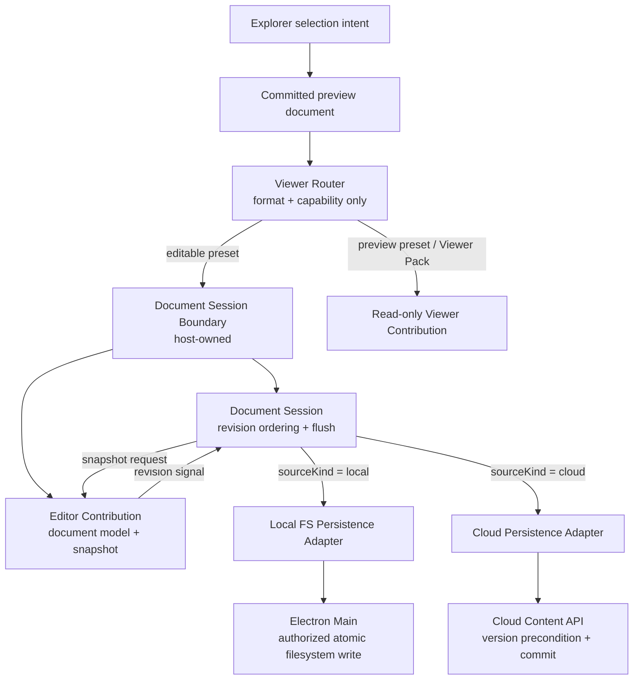
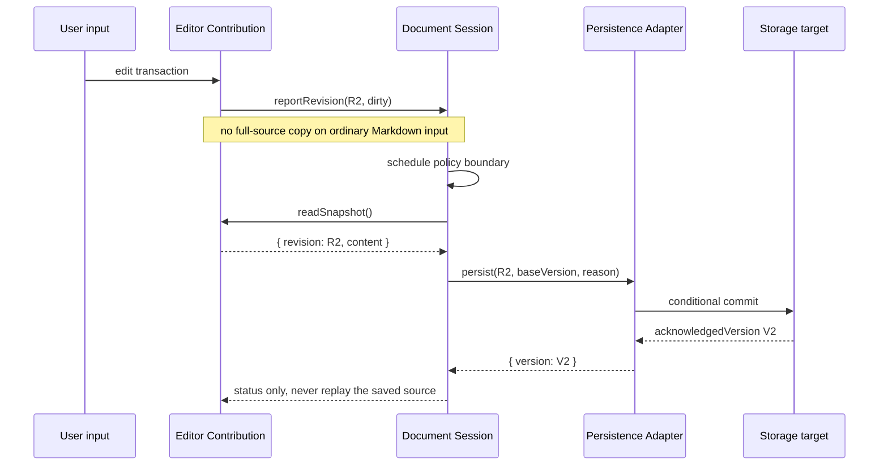
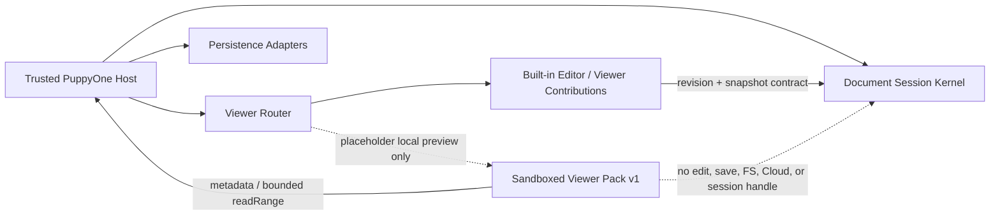

# Document Editing and Persistence Architecture

**Status:** Authoritative architecture. The host-owned Document Session is the
only coordinator for editable documents. Editors own document models and
snapshots; persistence adapters own storage-specific commits. Viewer Pack v1
remains read-only and never receives persistence authority.

## 1. Decision

PuppyOne separates four decisions that previously met inside
`TextEditorFrame`:

1. the **Viewer Router** decides which surface handles a file;
2. the **Editor Contribution** decides how that file is edited and serialized;
3. the **Document Session** decides when and in which order revisions commit;
4. the **Persistence Adapter** decides how a commit reaches its storage system.

The router and editor never call `fs`, Electron IPC, or Cloud HTTP. The
Document Session never interprets Markdown, CSV, or another file format. A
persistence adapter never owns editor UI or selection.



The component boundary is immediately after deterministic viewer resolution
and before a concrete editable renderer. The session object's lifetime is
host-owned: a file switch detaches the old editor but does not cancel a
required commit already queued for that document.

## 2. Ownership boundaries

### 2.1 Viewer Router

`resolveFileFormat()` and `PRESET_VIEWER_REGISTRY` remain pure classification.
They may answer `edit`, `preview`, or `placeholder`, plus source/runtime
requirements. They must not create timers, queues, storage clients, or file
handles.

### 2.2 Editor Contribution

An editable contribution owns:

- its in-memory document model and editing transactions;
- format-specific commands, undo/redo, selection, and rendering;
- a monotonically changing editor revision identity;
- a synchronous snapshot port that returns the exact source represented by
  that revision.

An editor reports ordinary changes as `{ revision, dirty }`. It does not push a
complete Markdown source string through React on each transaction. A complete
snapshot is read only at a persistence boundary. Format-specific serialization
belongs here because only the editor knows how its model becomes canonical
file content.

An editor does **not** own debounce policy, write retries, persisted-version
tracking, filesystem access, Cloud requests, or cross-document lifecycle.

### 2.3 Document Session

One session represents one `(workspace, document path)` identity. It owns:

- current, pending, in-flight, and acknowledged revision state;
- one serialized write pump: at most one commit is in flight;
- latest-revision coalescing while preserving flush waiters;
- idle and maximum-dirty scheduling supplied by the active adapter policy;
- mandatory flushes for manual save, mode switch, file switch, and destroy;
- `clean`, `dirty`, `saving`, `saved`, and `error` status;
- the base storage version used for optimistic concurrency;
- commit acknowledgement and conflict/error delivery to the trusted UI.

It is a framework-independent TypeScript object. React may subscribe to its
small status snapshot, but React render/effect ordering is not the write queue.
Destroying an Editor DOM tree cannot reorder, cancel, or directly start a
second write beside an in-flight write.

### 2.4 Persistence adapters

Persistence is a host capability with separate implementations:

| Concern | Local FS adapter | Cloud adapter |
| --- | --- | --- |
| Transport | authorized Electron IPC | authenticated Content API |
| Version | content fingerprint from read/write | backend commit id |
| Conflict guard | expected fingerprint before replacement | `base_commit_id` precondition |
| Commit | same-directory durable temporary write + replace | version-engine transaction |
| Scheduling | short local idle window | longer network-aware idle window |
| Retry | user-visible filesystem error; no blind overwrite | classified retry/backoff/offline policy |
| External changes | workspace watcher + fingerprint reconciliation | collaboration/version events |

The adapter is replaceable because Desktop can open local and Cloud documents,
but this is an **internal host strategy**, not third-party plugin authority.
The renderer never imports Node `fs`; Electron Main retains workspace
authorization and path containment.

## 3. Commit sequence



If `R3` arrives while `R2` is in flight, the session retains only the newest
pending snapshot. It never starts `R3` concurrently. When `R2` completes, the
same pump commits `R3`. Therefore an older write cannot finish after and
overwrite a newer one.

## 4. Flush and conflict rules

1. Idle save is an implementation policy, not a product-level “Save” concept.
2. A maximum-dirty deadline prevents continuous typing from postponing durable
   persistence forever.
3. File switch and editor destruction submit an exact final snapshot into the
   same serialized pump; they never bypass it.
4. A commit carries the version read with the document. A mismatch is a
   conflict, not permission to silently overwrite the external revision.
5. A successful acknowledgement advances the session base version. It may
   update caches and derived indexes, but must not replace the active node,
   recreate header actions, or dispatch saved source back into the editor.
6. Local and Cloud policies may differ without branching inside an Editor.
7. App shutdown must ask the session owner to flush; the main process remains
   the final authority for whether a local commit is accepted.

## 5. Plugin boundary

There are two extension axes, and only one is a product plugin surface.



| Layer | Ownership | Extension status |
| --- | --- | --- |
| Viewer Router | shared trusted host | not replaceable |
| Document Session kernel | shared trusted host | not replaceable or subclassable |
| Local/Cloud persistence adapters | trusted app composition | internal strategy extension only |
| Built-in Editor Contribution | format implementation | pluggable behind the trusted revision/snapshot contract |
| Viewer Pack v1 | sandboxed third party | pluggable read-only presentation only |
| Automation/Docker/runner session | Automation subsystem | separate from editor routing and document persistence |

There is no “Docker Session” inside the editor persistence path. Container,
sandbox, terminal, and agent runtime sessions belong to Automation. They may
consume an explicitly granted workspace capability, but they neither implement
an Editor Contribution nor replace a Document Session.

### Shared, non-pluggable kernel

- Document Session state machine and serialized write pump;
- dirty/status semantics and flush reasons;
- workspace/document identity and version checks;
- Local/Cloud adapter selection and security policy;
- conflict UX and cache/index acknowledgement routing.

Third-party code cannot replace or subclass this kernel. Otherwise a plugin
could reorder writes, bypass a version precondition, retain a session after
revocation, or acquire storage authority indirectly.

### Contribution extension point

Built-in format surfaces are immutable `PresetViewerContribution`s. An
editable built-in contribution plugs in below the Document Session Boundary
and implements only the editor-side revision/snapshot contract.

Viewer Pack v1 remains a separate, sandboxed, **read-only presentation**
adapter. It activates only for placeholder-grade local documents and receives
metadata and explicitly granted bounded resource reads. It cannot receive an
`EditorDocumentSession`, call a persistence adapter, access Cloud, or write a
workspace file.

A future editable-pack API, if separately approved, must expose a narrow
host-mediated edit transaction capability—not the Document Session object,
raw `fs`, or a Cloud client. The host would validate edits, advance the trusted
revision, and retain all commit/version authority. No such capability exists
in Viewer API v1.

### Internal strategy extension point

`LocalFsPersistenceAdapter` and `CloudPersistenceAdapter` implement the same
host port but are not marketplace plugins. New trusted storage sources may add
another adapter only in the app composition layer. They do not alter Editor
Contribution contracts.

## 6. Implementation placement

```text
packages/shared-ui/src/editor/document-session/
  DocumentEditingSession.ts       # framework-independent session kernel
  DocumentSessionBoundary.tsx     # trusted React composition/status bridge
  types.ts                         # revision/snapshot/session contracts

packages/shared-ui/src/editor/
  PuppyoneEditorHost.tsx           # route, then attach editable session
  viewers/*                        # format contribution only

src/lib/
  localFiles.ts                    # Local FS persistence adapter
  cloudDataPort.ts                 # Cloud persistence adapter

electron/main + local-api/
  workspace write IPC              # authorization + conditional atomic write
```

`DataWorkspace` binds persistence to the **committed preview document**, never
to the newest Explorer selection. It consumes successful commit
acknowledgements for the bounded content cache and Markdown link index; it does
not own the write queue.

## 7. Invariants and audit gates

- The Viewer Router is deterministic and side-effect free.
- Editable contributions receive a host-owned session, never a storage client.
- Viewer Pack v1 remains `editable: false` and cannot obtain a session.
- One document has at most one in-flight commit per session.
- Destroy/file-switch flushes join the queue; no direct write bypass exists.
- A commit acknowledgement is identified by editor revision and storage
  version.
- Local writes are path-authorized, version-checked, and replacement-safe.
- Cloud writes carry a backend version precondition when one was read.
- Ordinary Markdown input does not stringify the full document.
- Successful persistence does not replace the active tree node or cause
  unrelated header/icon refreshes.
- Focused session ordering, conflict, local FS, Cloud request, and Markdown
  snapshot tests are required before merging persistence changes.
