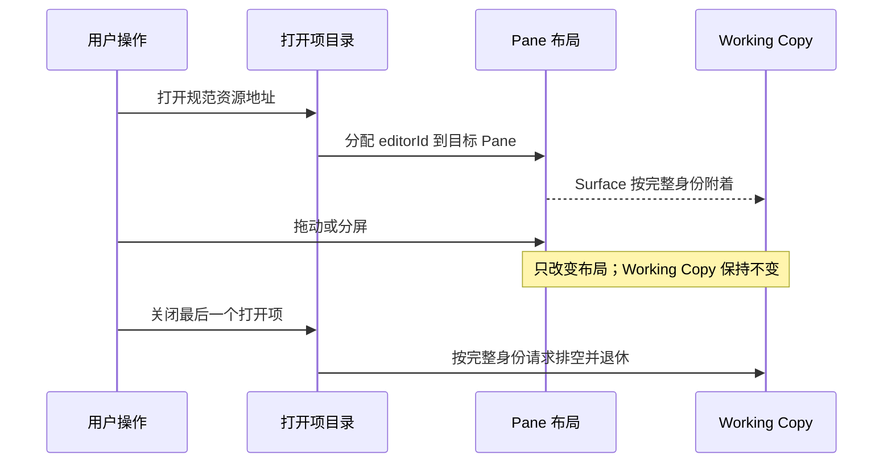

# Editor Workbench Boundaries

## 三层状态

编辑器工作台只用三层状态完成资源打开和移动，不增加额外的“移动服务”。

| 层 | 唯一职责 | 可以保存 | 禁止保存 |
| --- | --- | --- | --- |
| 打开项目录 | 哪些资源已打开、当前项与最近使用顺序 | 规范资源地址、标题、活动项、最近使用顺序 | 文件内容、保存状态、Viewer 内部状态 |
| Pane 布局 | 编辑器出现在哪个 Pane、分屏方向、比例和焦点 | Pane 与 Split 标识、`editorId` 引用、布局比例 | 资源内容、持久化端口、格式逻辑 |
| Working Copy | 文档模型、磁盘基线、版本、冲突和串行保存 | 运行期权威状态；退出前按协议排空 | Pane 坐标、拖拽状态、Viewer 选择 |

工作台的本地存储只恢复前两层元数据。Working Copy 不能从工作台的本地存储恢复，因为磁盘与条件写版本才是文档持久化事实来源。

## 地址与移动

所有进入打开项目录的工作区相对路径先统一分隔符、移除 `./`、重复斜杠和尾斜杠。`editorId` 使用这个规范地址；Working Copy 再把它与 `storageIdentity` 组合成完整文档身份。因此：

- 同一工作区内的等价路径不会重复打开；
- 不同工作区内的同名路径不会共享 Working Copy；
- 文件夹重命名使用“相同或子孙资源”判断，同时重映射打开项与 Pane 引用；
- Pane 移动只重排布局树，既不搬运模型，也不触发保存。

## 扩展新格式

新格式优先增加自己的 Contribution，并复用现有宿主能力：

1. 声明格式匹配、可编辑能力、输入要求和懒加载 Viewer；
2. 可编辑格式实现模型快照适配器，但不持有保存队列；
3. 只读二进制格式使用共享资源租约，不自行管理能力 URL；
4. 将格式加入对应一致性或资源失效矩阵。

只有当多个格式真正共享一套模型语义时才合并到同一格式家族，例如代码与纯文本、音频与视频。仅仅为了让目录看起来整齐，不应把无关格式塞进同一个组件。

## 自动边界

架构检查会阻止打开项和布局模型导入文档内容或持久化端口，并要求打开项入口规范化资源地址。测试覆盖等价路径去重、目录重命名、Pane 引用同步、重复可见资源清理和移动不复制编辑器。
